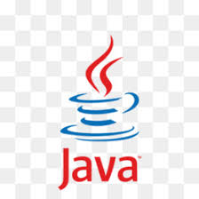
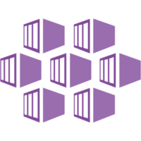
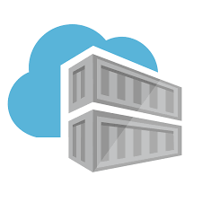
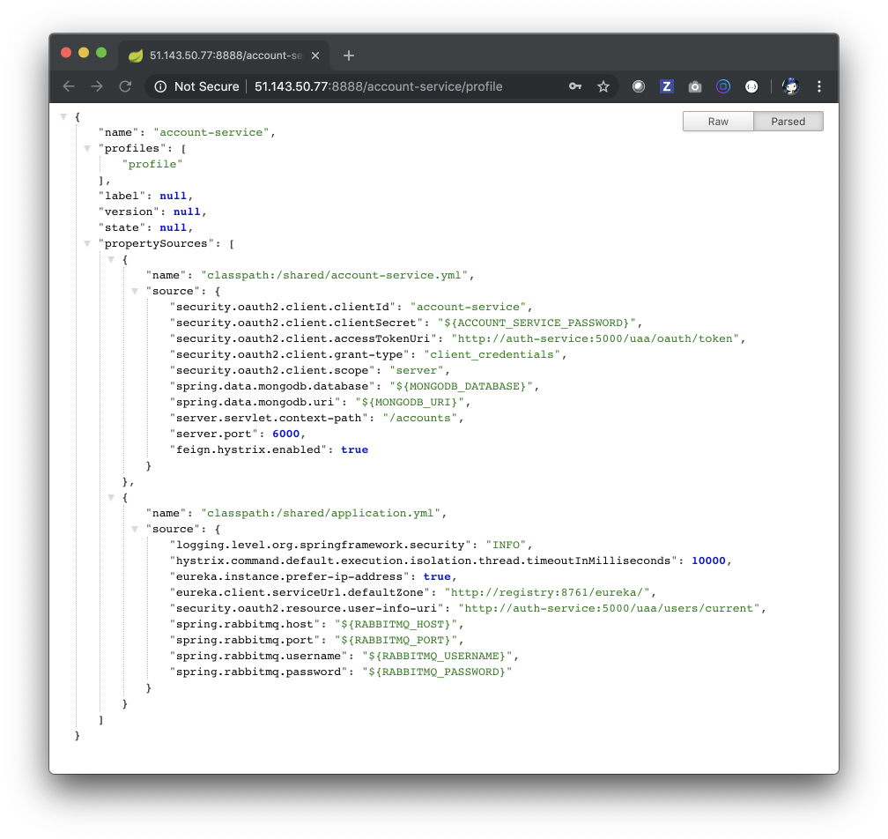
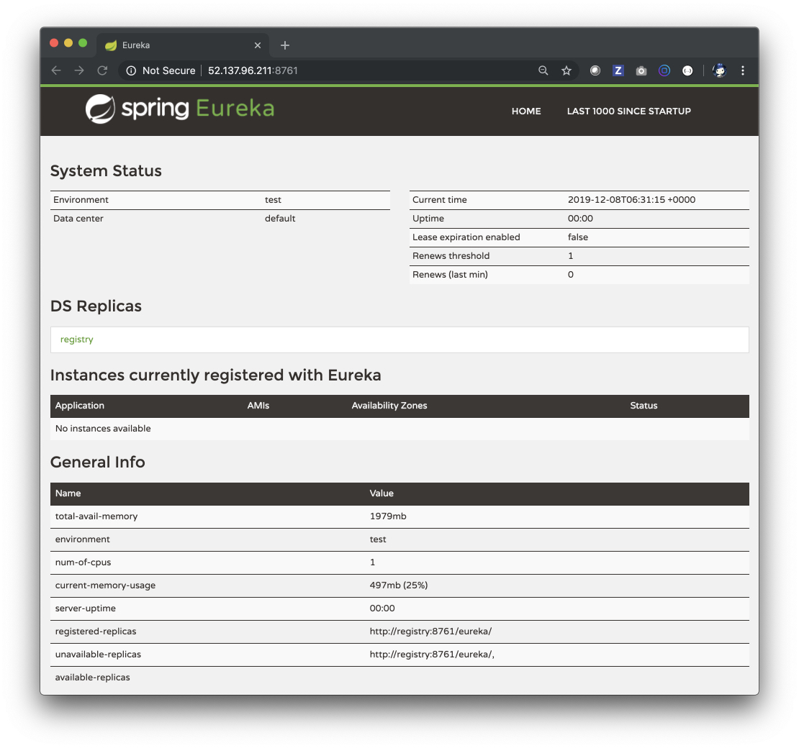

# End-to-end experience - Java on AKS

This guide walks you through how to deploy and manage Java apps on Azure Kubernetes Service.

<!--

## Editor's checklist
- What will you experience
- What you will need
- Start here
- Build Piggymetrics - Spring Cloud micro service apps
- Create Mongodb and RabbitMQ
- Run Piggymetrics locally 
- Create Azure Kubernetes Service and Azure Container Registry
- Deploy Piggymetrics to Azure Kubernetes Service
- Troubleshooting Java apps in Azure Kubernetes Service
- Automate and rapidly deploy changes to Azure Kubernetes Service - GitHub Actions or Azure Pipelines
- Rapidly deploy changes to Azure Spring Cloud without disruption - blue-green deployments
- Scale up Java apps in Azure Kubernetes Service
- Congratulations!
- Resources

-->

<!--
    
-->

## What will you experience

You will:
- Build Piggymetrics - build a proof-of-concept application, which demonstrates 
micro service architecture pattern using Spring Boot and Spring Cloud
- Create Mongodb and RabbitMQ on Azure
- Create Azure Kubernetes Service and Azure Container Registry
- Deploy Piggymetrics to Azure Kubernetes Service
- Troubleshoot Java apps in Azure Kubernetes Service
- Automate and rapidly deploy changes to Azure Kubernetes Service - GitHub Actions or Azure Pipelines
- Rapidly deploy changes to Azure Spring Cloud without disruption - blue-green deployments
- Scale up Java apps in Azure Kubernetes Service

## What you will need

In order to deploy a Java Web app to cloud, you need 
an Azure subscription. If you do not already have an Azure 
subscription, you can activate your 
[MSDN subscriber benefits](https://azure.microsoft.com/pricing/member-offers/msdn-benefits-details/) 
or sign up for a 
[free Azure account]((https://azure.microsoft.com/pricing/free-trial/)).

In addition, you will need the following:

| [Azure CLI](http://docs.microsoft.com/cli/azure/overview) 
| [Java 8](https://www.azul.com/downloads/azure-only/zulu) 
| [Maven 3](http://maven.apache.org/) 
| [Git](https://github.com/) 
| [ACR Docker Credential Helper](https://github.com/Azure/acr-docker-credential-helper)
| [Docker](https://docs.docker.com/v17.09/engine/installation/)
| [Kubectl](https://kubernetes.io/docs/tasks/tools/install-kubectl/)
| [Helm](https://helm.sh/docs/intro/install/)
| [dos2unix](https://brewinstall.org/install-dos2unix-on-mac-with-brew/)

## IMPORTANT - Start Here

Clone this GitHub repo and prep:
```bash
git clone https://github.com/Azure-Samples/java-on-aks.git

cd java-on-aks
```

## Create MongoDB and RabbitMQ

You can create MongoDB and RabbitMQ on Azure by following steps outlined [here](./docs/create-mongodb-and-rabbitmq.md)
and capture MongoDB and RabbitMQ coordinates and credentials in 
`setup-env-variables-development.sh` 
and `setup-env-variables-azure.sh`. 

## Create Azure Container Registry and Azure Kubernetes Service

### Create Azure Container Registry

Prep the dev environment by populating environment variables in 
`.scripts/setup-env-variables-azure.sh`
bash script:

```bash
# ====== Piggy Metrics Azure Coordinates
export RESOURCE_GROUP=INSERT-your-resource-group-name
export REGION=westus2
export AKS_CLUSTER=INSERT-your-AKS-cluster-name
export CONTAINER_REGISTRY=INSERT-your-Azure-Container-Registry-name

## ===== Mongo DB
export MONGODB_DATABASE=INSERT-your-mongodb-database-name
export MONGODB_USER=INSERT-your-cosmosdb-account-name
export MONGODB_URI="INSERT-your-mongodb-connection-string"
export MONGODB_RESOURCE_ID=INSERT-your-mongodb-resource-id

## ===== Rabbit MQ
export RABBITMQ_RESOURCE_GROUP=INSERT-your-rabbitmq-resource-group-name
export RABBITMQ_VM_NAME=INSERT-your-rabbitmq-virtual-machine-name
export RABBITMQ_ADMIN_USERNAME=INSERT-your-rabbitmq-admin-user-name

# Rabbit MQ
export RABBITMQ_HOST=INSERT-your-rabbitmq-host-public-ip-address
export RABBITMQ_PORT=5672
export RABBITMQ_USERNAME=INSERT-your-rabbitmq-username
export RABBITMQ_PASSWORD=INSERT-your-rabbitmq-password
```

Then, export these environment variables from the `java-on-aks` directory:

```bash
source .scripts/setup-env-variables-azure.sh
```

Create an Azure Container Registry instance using Azure CLI:
```bash
# Create a Resource Group, if you have not created one
az group create --name ${RESOURCE_GROUP} \
    --location ${REGION}
    
# Create Azure Container Registry
az acr create --name ${CONTAINER_REGISTRY} \
    --resource-group ${RESOURCE_GROUP} \
    --sku basic --location ${REGION}
    
# Log into Azure Container Registry
az acr login -n ${CONTAINER_REGISTRY}

```

### Create Azure Kubernetes Service

Create an Azure Kubernetes Service instance and attach Azure Container Registry using Azure CLI:
```bash
az aks create --name ${AKS_CLUSTER} \
    --resource-group ${RESOURCE_GROUP} \
    --location ${REGION} \
    --attach-acr ${CONTAINER_REGISTRY} \
    --node-vm-size Standard_DS3_v2 \
    --node-count 5
```

Get access credentials for the AKS cluster:
```bash
az aks get-credentials --name ${AKS_CLUSTER} \
    --resource-group ${RESOURCE_GROUP}
```

### Auto instrument for monitoring Java apps on Azure Kubernetes Service

Download Java agent ([download link](https://github.com/microsoft/Application-Insights-K8s-Codeless-Attach/releases))
for auto instrumenting for monitoring Java apps on Azure Kubernetes Service.

From a Linux or MacOS terminal, execute init.sh from the release.

```bash
source init.sh
```

Open the generated `values.yaml` file in an editor and fill up Kubernetes Cluster
 target namespace `default` and Application Insights `Instrumentation Key`. Like this:
 
```yaml
namespaces: 
  - target : "default" # kubernetes namespace where the Java apps will be auto-instrumented
    iKey: "c197cf6b-WWWW-XXXX-YYYY-ZZZZZZZZZZZZ" # Instrumentation Key of the receiving Application Insights resource
```

Install the Java agent for auto instrumentation:
```bash
helm install ./helm-<version>.tgz -f values.yaml --generate-name
```

## Deploy Piggymetrics to Azure Kubernetes Service

### Build and push container images for micro service apps

Build Java apps, container images and push images to Azure Container Registry
using Maven and [Jib](https://github.com/GoogleContainerTools/jib/tree/master/jib-maven-plugin):
 
```bash
cd config
mvn compile jib:build -Djib.container.environment=CONFIG_SERVICE_PASSWORD=${CONFIG_SERVICE_PASSWORD}

cd ../registry
mvn compile jib:build

cd ../gateway
mvn compile jib:build

cd ../auth-service
mvn compile jib:build

cd ../account-service
mvn compile jib:build -Djib.container.environment=ACCOUNT_SERVICE_PASSWORD=${ACCOUNT_SERVICE_PASSWORD}

cd ../statistics-service
mvn compile jib:build -Djib.container.environment=STATISTICS_SERVICE_PASSWORD=${STATISTICS_SERVICE_PASSWORD}

cd ../notification-service
mvn compile jib:build -Djib.container.environment=NOTIFICATION_SERVICE_PASSWORD=${NOTIFICATION_SERVICE_PASSWORD}

```
### Prepare Kubernetes manifest files

Prepare Kubernetes manifest files using the supplied `bash` script:

```bash
# cd to kubernetes folder
cd ../kubernetes
source ../.scripts/prepare-kubernetes-manifest-files.sh

```
### Create Secrets in Kubernetes

You can create Secrets in Kubernetes:
```bash
kubectl apply -f deploy/0-secrets.yaml

# you can view Secrets in Kubernetes using:
kubectl get secret piggymetrics -o yaml
```

### Deploy Spring Cloud Config Server

You can deploy the Spring Cloud Config Server to Kubernetes:
```bash
kubectl apply -f deploy/1-config.yaml
```

### Deploy Spring Cloud Service Registry

You can deploy the Spring Cloud Service Registry to Kubernetes:
```bash
kubectl apply -f deploy/2-registry.yaml
```

You can validate that a Spring Cloud Config Server is up and running by
invoking its REST API.

The Spring Cloud Config Server REST API has resources in the following form:

```bash
/{application}/{profile}[/{label}]
/{application}-{profile}.yml
/{label}/{application}-{profile}.yml
/{application}-{profile}.properties
/{label}/{application}-{profile}.properties
```

You can get IP addresses of Spring Cloud Config Server and Spring Cloud Service Registry 
using `kubectl`:

```bash
kubectl get services
NAME         TYPE           CLUSTER-IP    EXTERNAL-IP     PORT(S)          AGE
config       LoadBalancer   10.0.34.171   51.143.50.77    8888:31892/TCP   3m15s
kubernetes   ClusterIP      10.0.0.1      <none>          443/TCP          3h42m
registry     LoadBalancer   10.0.198.13   52.137.96.211   8761:31689/TCP   6s
```

Try:
```bash
open http://<EXTERNAL-IP-of-config>:8888/gateway/profile
open http://<EXTERNAL-IP-of-config>:8888/account-service/profile
open http://<EXTERNAL-IP-of-config>:8888/statistics-service/profile
open http://<EXTERNAL-IP-of-config>:8888/notification-service/profile
...
open http://<EXTERNAL-IP-of-config>:8888/notification-service/profile/development
...
```



You can validate that a Spring Cloud Service Registry is up and running by 
opening the Service Registry Dashboard:

```bash
open http://<EXTERNAL-IP-of-registry>:8761/
```



### Deploy Spring Cloud Gateway

You can deploy the Spring Cloud Service Registry to Kubernetes:
```bash
kubectl apply -f deploy/3-gateway.yaml
```

### Deploy 4 Spring Cloud micro service apps 

You can deploy Spring Cloud micro service apps to Kubernetes:

```bash
kubectl apply -f deploy/4-auth-service.yaml
kubectl apply -f deploy/5-account-service.yaml
kubectl apply -f deploy/6-statistics-service.yaml
kubectl apply -f deploy/7-notification-service.yaml
```

You can validate that Spring Cloud middleware components and micro service apps are running:

```bash
kubectl get services
NAME                   TYPE           CLUSTER-IP     EXTERNAL-IP     PORT(S)          AGE
account-service        ClusterIP      10.0.215.174   <none>          6000/TCP         108s
auth-service           ClusterIP      10.0.164.45    <none>          5000/TCP         2m26s
config                 LoadBalancer   10.0.34.171    51.143.50.77    8888:31892/TCP   24m
gateway                LoadBalancer   10.0.154.13    52.143.88.12    80:31412/TCP     4m3s
kubernetes             ClusterIP      10.0.0.1       <none>          443/TCP          4h3m
notification-service   ClusterIP      10.0.169.231   <none>          8000/TCP         63s
registry               LoadBalancer   10.0.198.13    52.137.96.211   8761:31689/TCP   21m
statistics-service     ClusterIP      10.0.217.229   <none>          7000/TCP         76s
```

### Open the Spring Cloud micro service apps on Kubernetes

Open the Piggymetrics landing page by using the`gateway' app's `EXTERNAL-IP`.

```bash
open http://<EXTERNAL-IP-of-gateway>/
```

For example: 


## Troubleshooting micro service apps in Azure Spring Cloud

With out-of-the-box support for aggregating logs, metrics, and 
distributed app traces into Azure Monitor, you can easily visualize 
how your applications are performing, detect and diagnose issues 
across micro service applications and their dependencies, drill 
into monitoring data for troubleshooting and gain better 
understanding of what end-users do with your apps.

### Debug in development machine
You can run Spring Cloud Config, Spring Cloud Service Registry, 
Spring Cloud Gateway and other Spring Cloud components on their dev machine. 
You can attach debuggers to Spring Cloud micro service apps and step through them. You can 
look at logs and metrics. Use Java Flight Recorder, etc.

### Use aggregated logs and metrics in Azure Log Analytics

You can aggregate logs in Azure Log Analytics and retrieve them 
using Kusto queries. If you do not have a Log Analytics Workspace in Azure, 
see [how to create a Log Analytics Workspace](./docs/create-log-analytics.md)

You can onboard your Kubernetes cluster to Azure Monitor for monitoring, by clicking
on the `Logs` blade in the Azure Portal and choosing your Log Analytics Workspace:


You can then view logs using Kusto queires in the logs blade of your Azure Spring Cloud instance:


Here are some sample Kusto queries for viewing logs for each of the micro service apps -
please replace `java-on-aks` with your Azure Kubernetes cluster name:

```sql
let ContainerIdList = KubePodInventory
| where ContainerName contains 'config'
| where ClusterId contains 'java-on-aks'
| distinct ContainerID;
ContainerLog
| where ContainerID in (ContainerIdList)
| where LogEntry !contains "AI:" 
| project LogEntrySource, LogEntry, TimeGenerated, Computer, Image, Name, ContainerID
| order by TimeGenerated desc
| render table

let ContainerIdList = KubePodInventory
| where ContainerName contains 'registry'
| where ClusterId contains 'java-on-aks'
| distinct ContainerID;
ContainerLog
| where ContainerID in (ContainerIdList)
| where LogEntry !contains "AI:" 
| project LogEntrySource, LogEntry, TimeGenerated, Computer, Image, Name, ContainerID
| order by TimeGenerated desc
| render table

let ContainerIdList = KubePodInventory
| where ContainerName contains 'gateway'
| where ClusterId contains 'java-on-aks'
| distinct ContainerID;
ContainerLog
| where ContainerID in (ContainerIdList)
| where LogEntry !contains "AI:" 
| project LogEntrySource, LogEntry, TimeGenerated, Computer, Image, Name, ContainerID
| order by TimeGenerated desc
| render table

let ContainerIdList = KubePodInventory
| where ContainerName contains 'account-service'
| where ClusterId contains 'java-on-aks'
| distinct ContainerID;
ContainerLog
| where ContainerID in (ContainerIdList)
| where LogEntry !contains "AI:" 
| project LogEntrySource, LogEntry, TimeGenerated, Computer, Image, Name, ContainerID
| order by TimeGenerated desc
| render table

let ContainerIdList = KubePodInventory
| where ContainerName contains 'auth-service'
| where ClusterId contains 'java-on-aks'
| distinct ContainerID;
ContainerLog
| where ContainerID in (ContainerIdList)
| where LogEntry !contains "AI:" 
| project LogEntrySource, LogEntry, TimeGenerated, Computer, Image, Name, ContainerID
| order by TimeGenerated desc
| render table

```
### Use Application Insights to monitor your micro service apps

You can use Application Insights to monitor your live web application. It will 
automatically detect performance anomalies. It includes powerful analytics tools to 
help you diagnose issues and to understand what users actually do with your app. It is designed to 
help you continuously improve performance and usability.

If you do not have an instance of Application Insights, see
 [how to create Application Insights](./docs/create-application-insights.md).

Allow some time, then you can see distributed tracing:


You can also view the performance and call drill downs in the App Insights view:


## Automate and rapidly deploy changes to Azure Kubernetes Service - GitHub Actions or Azure Pipelines

[To be filled by UshaN]

## Rapidly deploy changes to Azure Spring Cloud without disruption - blue-green deployments

[To be filled by UshaN]

## Scale out micro service apps in Azure Kubernetes Service

You can scale out micro service apps in Azure Kubernetes Service:
```bash
kubectl scale deployment gateway --replicas=4

kubectl describe deployment gateway
Name:                   gateway
Namespace:              default
CreationTimestamp:      Sat, 07 Dec 2019 22:36:27 -0800
Labels:                 app=gateway
                        project=piggymetrics
                        tier=frontend
Annotations:            deployment.kubernetes.io/revision: 1
                        kubectl.kubernetes.io/last-applied-configuration:
                          {"apiVersion":"extensions/v1beta1","kind":"Deployment","metadata":{"annotations":{},"labels":{"app":"gateway","project":"piggymetrics","ti...
Selector:               app=gateway,project=piggymetrics,tier=frontend
Replicas:               4 desired | 4 updated | 4 total | 4 available | 0 unavailable
```

## Congratulations

Congratulations!! 

You built, deployed, scaled out and setup monitoring for Spring Cloud micro service apps
using Spring Boot and Spring Cloud, Azure Kubernetes Service, Azure Container Registry,
Azure Monitor, Log Analytics and Application Insights.

## Resources

- [Azure Kubernetes Story](https://docs.microsoft.com/en-us/azure/aks/)
- [Azure Container Registry](https://docs.microsoft.com/en-us/azure/container-registry/)
- [Kusto Query Language](https://docs.microsoft.com/en-us/azure/kusto/query/)
- [Triage Micro Service Applications using Application Map](https://docs.microsoft.com/en-us/azure/azure-monitor/app/app-map)
- [Azure for Java Cloud Developers](https://docs.microsoft.com/en-us/azure/java/)
- [Spring Cloud Azure](https://cloud.spring.io/spring-cloud-azure/)
- [Spring Cloud](https://spring.io/projects/spring-cloud)
- ...

## Credits

This Java micro services sample is forked from 
[sqshq/Piggymetrics](https://github.com/sqshq/PiggyMetrics) - see [Piggymetrics README](./README-piggymetrics.md). 

## Contributing

This project welcomes contributions and suggestions.  Most contributions require you to agree to a
Contributor License Agreement (CLA) declaring that you have the right to, and actually do, grant us
the rights to use your contribution. For details, visit https://cla.opensource.microsoft.com.

When you submit a pull request, a CLA bot will automatically determine whether you need to provide
a CLA and decorate the PR appropriately (e.g., status check, comment). Simply follow the instructions
provided by the bot. You will only need to do this once across all repos using our CLA.

This project has adopted the [Microsoft Open Source Code of Conduct](https://opensource.microsoft.com/codeofconduct/).
For more information see the [Code of Conduct FAQ](https://opensource.microsoft.com/codeofconduct/faq/) or
contact [opencode@microsoft.com](mailto:opencode@microsoft.com) with any additional questions or comments.
